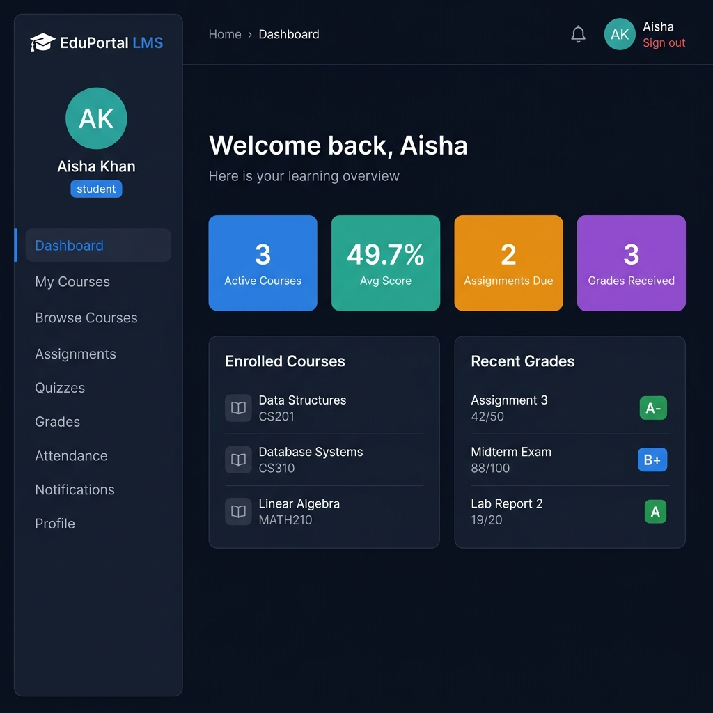
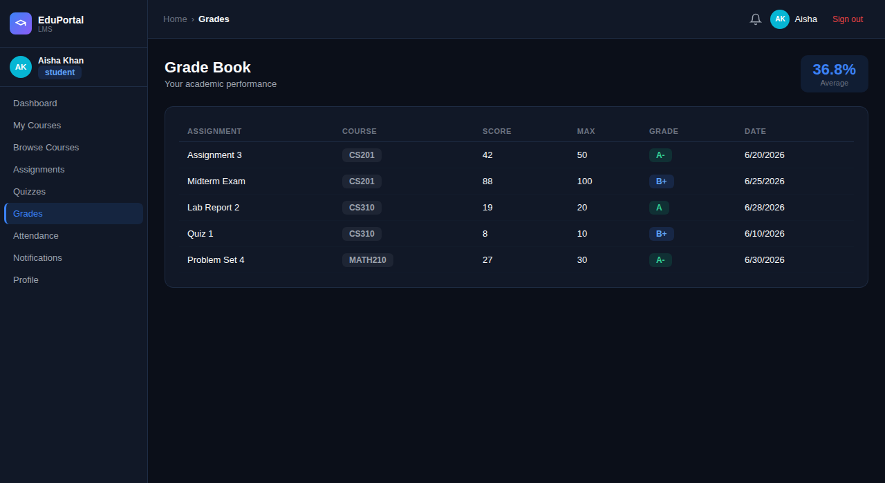
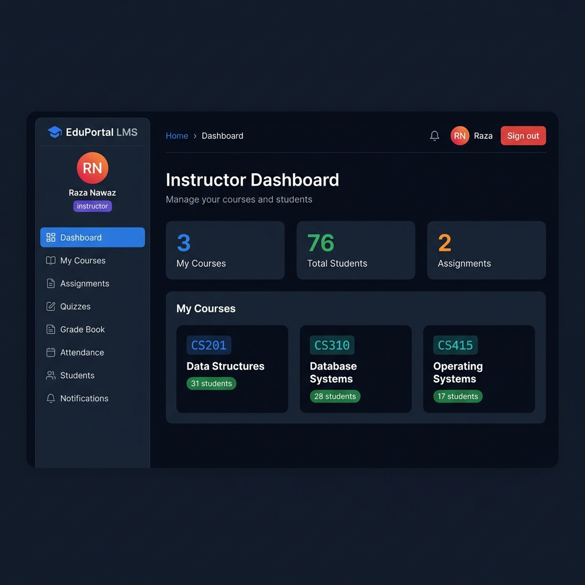
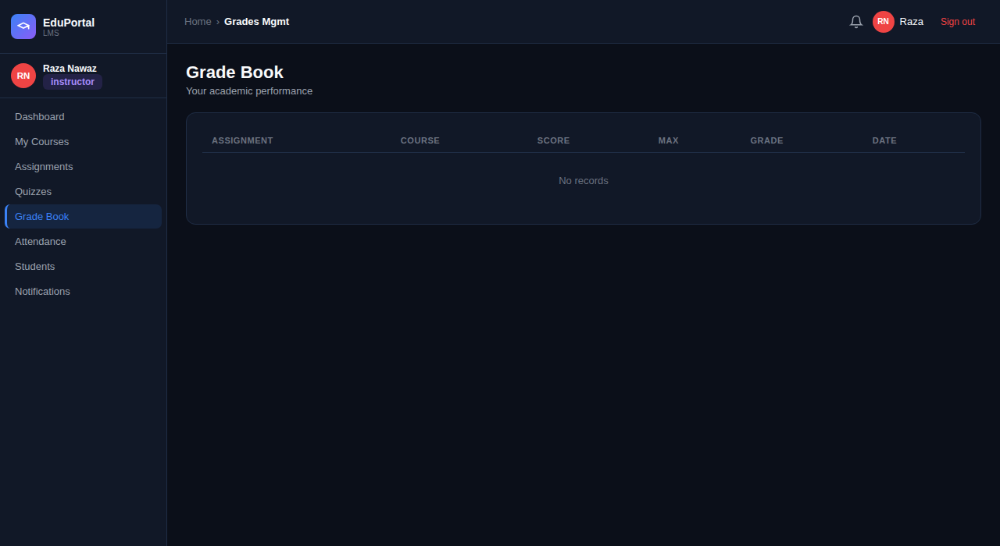
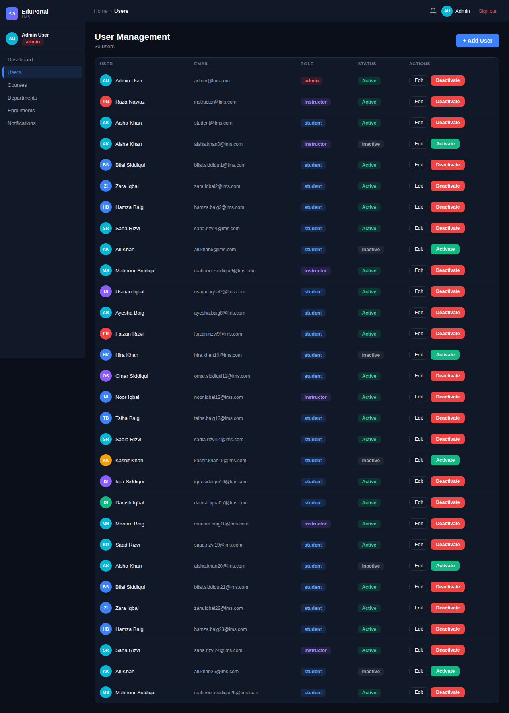

<div align="center">


# 🎓 EduPortal LMS

**A full-stack Learning Management System built with Node.js, Oracle DB, MongoDB & React**

[](https://nodejs.org)
[](https://react.dev)
[](https://www.oracle.com/database/)
[](https://mongodb.com)
[](https://jwt.io)
[](LICENSE)

</div>

---

## 📸 Screenshots

### 🎓 Student Dashboard
> Students see their active courses, grade averages, upcoming assignments, and recent grades at a glance.



---

### 📊 Student Grade Book
> Students can track all their grades across courses with letter grades, scores, and dates.



---

### 👨‍🏫 Instructor Dashboard
> Instructors manage their courses, view total enrolled students, and track assignments.



---

### 📋 Instructor Grade Management
> Instructors can review and manage grade books for their courses.



---

### 🛡️ Admin — User Management
> Administrators have full control over all users, roles, and activation status.



---

## 🏗️ Architecture

```
EduPortal LMS
├── backend/                  # Node.js + Express REST API
│   ├── config/               # Oracle & MongoDB connections
│   ├── middleware/           # JWT authentication middleware
│   ├── models/
│   │   ├── sql/              # Sequelize models (Oracle)
│   │   └── mongo/            # Mongoose models (MongoDB)
│   ├── routes/               # REST API routes
│   └── server.js             # App entry point
├── frontend/                 # React + Vite SPA
│   └── src/
│       ├── App.jsx           # Main application & all components
│       └── api.js            # API client
└── docs/
    ├── schema.sql            # Oracle DB schema
    └── images/              # Dashboard screenshots
```

| Layer | Technology |
|-------|-----------|
| **Frontend** | React 18 + Vite + Inline CSS (no framework) |
| **Backend** | Node.js + Express.js |
| **SQL Database** | Oracle XE 21c via Sequelize ORM |
| **NoSQL Database** | MongoDB via Mongoose |
| **Authentication** | JWT (JSON Web Tokens) + bcrypt |
| **Authorization** | RBAC — Student / Instructor / Admin |

---

## ✨ Features

### 🎓 Student Features
- 📚 Browse and enroll in available courses
- 📝 View upcoming and past assignments
- 📊 Track grades with letter grade breakdown and average score
- 📅 Monitor attendance records and percentage
- 🔔 Real-time notifications
- 🧪 Take quizzes

### 👨‍🏫 Instructor Features
- 🗂️ Manage assigned courses and enrolled students
- ✍️ Create assignments with due dates and point values
- 📋 Enter and manage student grades
- 📌 Mark student attendance
- 📊 View course enrollment stats

### 🛡️ Admin Features
- 👥 Full user management (create, activate, deactivate users)
- 🏛️ Manage departments and courses
- 📈 View system-wide enrollment data
- 🔔 Send system notifications

---

## 🔐 Role-Based Access Control (RBAC)

| Action | 🎓 Student | 👨‍🏫 Instructor | 🛡️ Admin |
|--------|:---:|:---:|:---:|
| View enrolled courses | ✅ | ✅ | ✅ |
| Browse & enroll in courses | ✅ | ❌ | ✅ |
| View own grades | ✅ | ❌ | ✅ |
| View own attendance | ✅ | ❌ | ✅ |
| Take quizzes | ✅ | ❌ | ❌ |
| Create assignments | ❌ | ✅ | ✅ |
| Grade students | ❌ | ✅ | ✅ |
| Mark attendance | ❌ | ✅ | ✅ |
| Manage courses | ❌ | ✅ | ✅ |
| Delete courses | ❌ | ❌ | ✅ |
| Manage users | ❌ | ❌ | ✅ |
| Manage departments | ❌ | ❌ | ✅ |

---

## 🚀 Getting Started

### Prerequisites

- Node.js v18+
- Oracle XE 21c (running on `localhost:1521`)
- MongoDB Community Server (running on `localhost:27017`)
- npm / npx

---

## 1️⃣ Oracle Database Setup

### Install Oracle XE 21c
Download from: https://www.oracle.com/database/technologies/xe-downloads.html

After install, Oracle runs on `localhost:1521` with service `XEPDB1` or `ORCLPDB`.

### Create the LMS user and schema

Open SQL*Plus or SQL Developer, connect as SYSDBA:

```sql
-- Connect as: sqlplus sys/your_sys_password@localhost:1521/XEPDB1 as sysdba
CREATE USER lms_user IDENTIFIED BY your_password;
GRANT CONNECT, RESOURCE, DBA TO lms_user;
```

Then connect as `lms_user` and run the full schema:

```bash
sqlplus lms_user/your_password@localhost:1521/XEPDB1 @docs/schema.sql
```

### Verify in SQL Developer
1. Open SQL Developer → New Connection
2. Username: `lms_user` | Password: your password
3. Hostname: `localhost` | Port: `1521` | Service: `XEPDB1`
4. Click **Test** → should say ✅ Success

---

## 2️⃣ MongoDB Setup

### Install MongoDB Community Server
Download from: https://www.mongodb.com/try/download/community

Start the service:

```bash
# Windows
net start MongoDB

# macOS
brew services start mongodb-community

# Linux
sudo systemctl start mongod
```

Connect in **MongoDB Compass** with: `mongodb://localhost:27017`

> ℹ️ No schema setup needed — Mongoose creates collections automatically on first write.

---

## 3️⃣ Backend Setup

```bash
cd backend

# Install dependencies
npm install

# Create environment file
cp .env.example .env   # or create .env manually (see below)
```

### Configure `.env`

```env
# ─── Oracle DB ──────────────────────────────
ORACLE_USER=lms_user
ORACLE_PASSWORD=your_oracle_password
ORACLE_HOST=localhost
ORACLE_PORT=1521
ORACLE_SID=ORCLPDB
ORACLE_CONNECT_STRING=localhost:1521/ORCLPDB

# ─── MongoDB ────────────────────────────────
MONGO_URI=mongodb://localhost:27017/lms_db

# ─── JWT ────────────────────────────────────
JWT_SECRET=replace_with_a_random_32+_char_string
JWT_EXPIRES_IN=7d

# ─── Server ─────────────────────────────────
PORT=5000
NODE_ENV=development
FRONTEND_URL=http://localhost:5173
```

### Start the backend

```bash
npm run dev
# or
node server.js
```

You should see:

```
✅ Oracle DB connected
✅ MongoDB connected: localhost
LMS Server running on http://localhost:5000
```

### Test the API

```
GET http://localhost:5000/api/health
```

---

## 4️⃣ Frontend Setup

```bash
cd frontend

# Install dependencies
npm install

# Start dev server
npm run dev
# Runs on http://localhost:5173
```

> The API base URL is configured as `http://localhost:5000/api` in `src/App.jsx`.

---

## 5️⃣ Seed First Users

Register users via the API (no UI registration screen for security):

### Admin user

```bash
curl -X POST http://localhost:5000/api/auth/register \
  -H "Content-Type: application/json" \
  -d '{
    "first_name": "Admin",
    "last_name": "User",
    "email": "admin@lms.com",
    "username": "admin",
    "password": "Admin@1234",
    "role": "admin"
  }'
```

### Instructor user

```bash
curl -X POST http://localhost:5000/api/auth/register \
  -H "Content-Type: application/json" \
  -d '{
    "first_name": "Raza",
    "last_name": "Nawaz",
    "email": "instructor@lms.com",
    "username": "instructor",
    "password": "Instructor@1234",
    "role": "instructor"
  }'
```

### Student user

```bash
curl -X POST http://localhost:5000/api/auth/register \
  -H "Content-Type: application/json" \
  -d '{
    "first_name": "Aisha",
    "last_name": "Khan",
    "email": "student@lms.com",
    "username": "student",
    "password": "Student@1234",
    "role": "student"
  }'
```

Then log in via the frontend at `http://localhost:5173`.

---

## 🔧 Troubleshooting

### Oracle connection fails
```
❌ Oracle connection failed: ORA-12541: No listener
```
- Make sure Oracle XE is running: `lsnrctl status`
- Verify service name matches `ORACLE_SID` in `.env` (e.g. `ORCLPDB` not `XEPDB1`)
- Check `ORACLE_CONNECT_STRING` in `.env` matches exactly

### MongoDB connection fails
```
❌ MongoServerSelectionError
```
- Run `mongod --version` to confirm MongoDB is installed
- Ensure the `mongod` service is running: `net start MongoDB` (Windows)
- Default URI: `mongodb://localhost:27017/lms_db`

### JWT errors on frontend
- Token stored in `localStorage` under key `lms_token`
- Clear site data / localStorage and log in again if you see `401` errors

### CORS errors on frontend
- Make sure `FRONTEND_URL` in `.env` matches your Vite dev server port (default `http://localhost:5173`)
- Do not mix HTTP and HTTPS origins

---

## 📁 Project Structure

```
Eduportal/
├── backend/
│   ├── config/
│   │   ├── mongodb.js          # Mongoose connection
│   │   └── oracle.js           # Sequelize + Oracle connection
│   ├── middleware/
│   │   └── auth.js             # JWT verification middleware
│   ├── models/
│   │   ├── mongo/
│   │   │   ├── CourseContent.js
│   │   │   ├── Notification.js
│   │   │   └── QuizQuestions.js
│   │   └── sql/
│   │       ├── index.js        # Model associations
│   │       ├── User.js
│   │       ├── Student.js
│   │       ├── Instructor.js
│   │       ├── Admin.js
│   │       ├── Course.js
│   │       ├── Department.js
│   │       ├── Enrollment.js
│   │       ├── Assignment.js
│   │       ├── Quiz.js
│   │       ├── QuizResult.js
│   │       ├── Grade.js
│   │       ├── Attendance.js
│   │       └── StudentProfile.js
│   ├── routes/
│   │   ├── auth.js
│   │   ├── users.js
│   │   ├── courses.js
│   │   ├── departments.js
│   │   ├── enrollments.js
│   │   ├── assignments.js
│   │   ├── grades.js
│   │   ├── attendance.js
│   │   ├── quizzes.js
│   │   └── notifications.js
│   ├── package.json
│   └── server.js
├── frontend/
│   └── src/
│       ├── App.jsx             # Full React SPA (all components)
│       └── api.js              # API client
├── docs/
│   ├── schema.sql              # Oracle DB schema
│   └── images/                 # Dashboard screenshots
├── .gitignore
└── README.md
```

---

## 🗄️ Database Schema Overview

The Oracle schema implements the LMS Extended Entity-Relationship Diagram (EERD) with **disjoint total specialisation**:

```
USERS (supertype)
├── STUDENTS     (subtype)
├── INSTRUCTORS  (subtype)
└── ADMINS       (subtype)

DEPARTMENTS ──< COURSES >── INSTRUCTORS
STUDENTS ──< ENROLLMENTS >── COURSES
COURSES ──< ASSIGNMENTS >── GRADES >── STUDENTS
COURSES ──< QUIZZES >── QUIZ_RESULTS >── STUDENTS
COURSES ──< ATTENDANCE >── STUDENTS
```

MongoDB stores:
- 📄 `notifications` — real-time user notifications
- 📄 `quizquestions` — flexible quiz question bank
- 📄 `coursecontents` — rich course content/materials


<div align="center">

Made with ❤️ for the DB Project — EduPortal LMS

</div>
